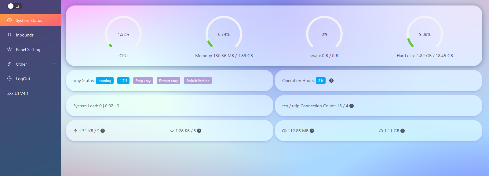
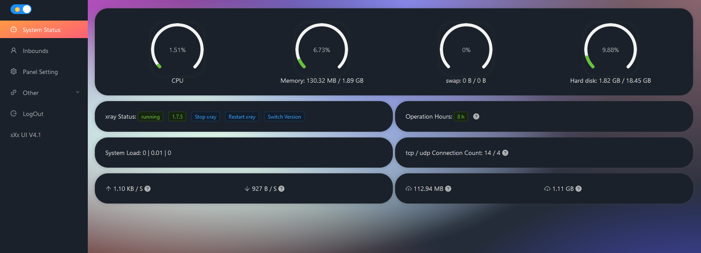
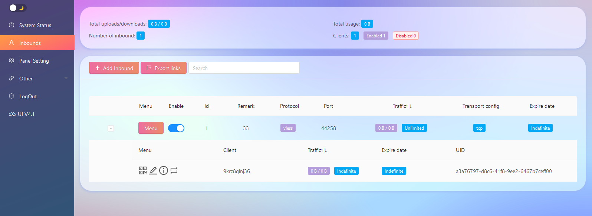
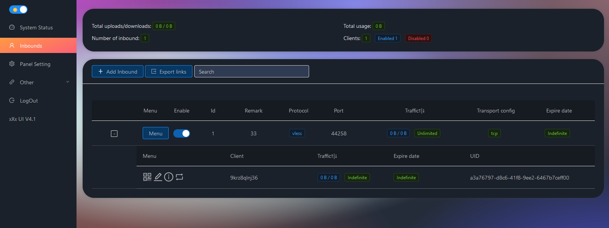

## xXx-ui
> **Disclaimer: This project is only for personal learning and communication, please do not use it for illegal purposes, please do not use it in a production environment**

xray panel supporting multi-protocol, **Multi-lang (English,Farsi,Chinese)**

| Features        | Enable?           |
| ------------- |:-------------:|
| Multi-lang | :heavy_check_mark: |
| Dark/Light Theme | :heavy_check_mark: |
| Search in deep | :heavy_check_mark: |
| Inbound Multi User | :heavy_check_mark: |
| Multi User Traffic & Expiration time | :heavy_check_mark: |
| REST API | :heavy_check_mark: |
| Telegram BOT (admin + clients) | :heavy_check_mark: |
| Backup database using Telegram BOT | :heavy_check_mark: |
| Subscription link | :heavy_check_mark: |
| Calculate expire date on first usage | :heavy_check_mark: |


## Install & Upgrade

```
bash <(curl -Ls https://raw.githubusercontent.com/MrCenTury/xXx-UI/master/install.sh)
```

## SSL
```
apt-get install certbot -y
certbot certonly --standalone --agree-tos --register-unsafely-without-email -d yourdomain.com
certbot renew --dry-run
```

## Features
- System Status Monitoring
- Search within all inbounds and clients
- Support Dark/Light theme UI
- Support multi-user multi-protocol, web page visualization operation
- Support for configuring more transport configurations
- Traffic statistics, limit traffic, limit expiration time
- Support subscription ( multi ) link
- Detect users which are expiring or exceed traffic limit soon
- Support https access panel (self-provided domain name + ssl certificate)
- Support one-click SSL certificate application and automatic renewal
- Update the Jason file for IP hiding changes and receiving the required data
- Geosite site config update for Iran
- Update to add user instead of email
- multi-user vmess - vless - trojan
- Support checking system status information
- support multi protocols and multi users
- support protocols：vmess、vless、trojan、shadowsocks、dokodemo-door、socks、http
- support many transport method including tcp、udp、ws、kcp etc
- traffic counting,traffic restrict and time restrcit
- support custom configuration template
- support https access fot WebUI
- support SSL cert issue by Acme
- support telegram bot notify and control
- more functions in control menu


## Panel Web


## shortcut  
After Installation，you can input `x-ui`to enter control menu，current menu details：
```
--------------------------------------------------------------------------------
      __  __ ____                 __  __           _   _ ___
     |  \/  |  _ \          __  __\ \/ /__  __    | | | |_ _|
     | |\/| | |_) |  _____  \ \/ / \  / \ \/ /____| | | || |
     | |  | |  _ <  |_____|  >  <  /  \  >  <_____| |_| || |
     |_|  |_|_| \_\         /_/\_\/_/\_\/_/\_\     \___/|___|

--------------------------------------------------------------------------------
  xXx-UI PANEL MANAGEMENT SCRIPT
  Press Enter to exit the script
--------------------------------------------------------------------------------
  0. Install xXx-UI
  1. Update xXx-UI
  2. Uninstalled xXx-UI
--------------------------------------------------------------------------------
  3. Reset Username Password
  4. Reset Panel Settings
  5. Set the Panel Web Port
  6. Check panel info
--------------------------------------------------------------------------------
  7. Start xXx-UI
  8. Stop xXx-UI
  9. Restart xXx-UI
 10. Check xXx-UI Status
 11. View xXx-UI Log
--------------------------------------------------------------------------------
 12. Set the xXx-UI auto-start at boot
 13. Cancel the xXx-UI auto-start at boot
--------------------------------------------------------------------------------
 14. Update Geosite and Geoip
 15. One-click installation BBR (the latest kernel)
 16. One-click application certificate (ACME script application)
 17. Open all network ports in the server
 18. Install and configure Cloudflare Warp (Experimental)
--------------------------------------------------------------------------------
 19. Backup Database
 20. Recovery Database
--------------------------------------------------------------------------------
 21. Backup Auto DataBase Cronjob in Telegram
 22. -> Telegram CronJob Time Change
 23. --> Disable Telegram Backup Auto
--------------------------------------------------------------------------------
```

## Suggested system as follows:
- CentOS 7+
- Ubuntu 16+
- Debian 8+

## telegram
- [Group](https://t.me/xui_fa)

## credits
- [vaxilu/x-ui](https://github.com/vaxilu/x-ui)
- [XTLS/Xray-core](https://github.com/XTLS/Xray-core)
- [telegram-bot-api](https://github.com/go-telegram-bot-api/telegram-bot-api)  
