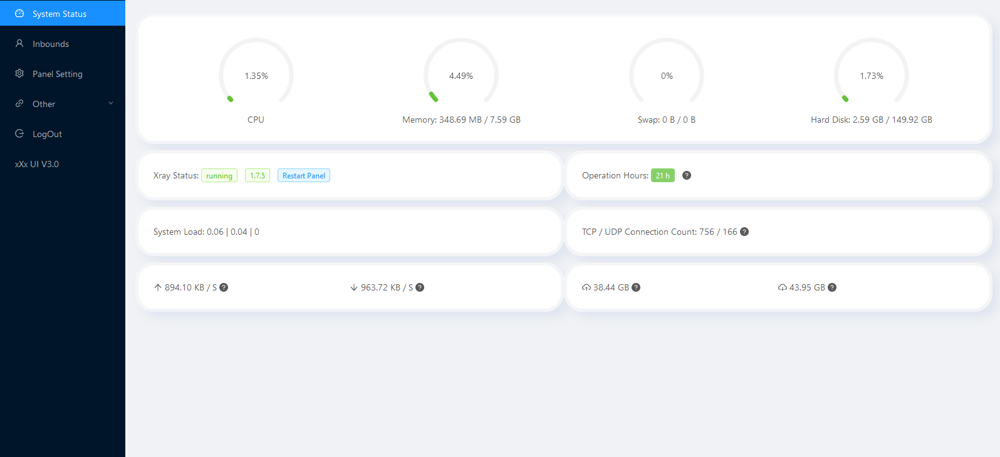
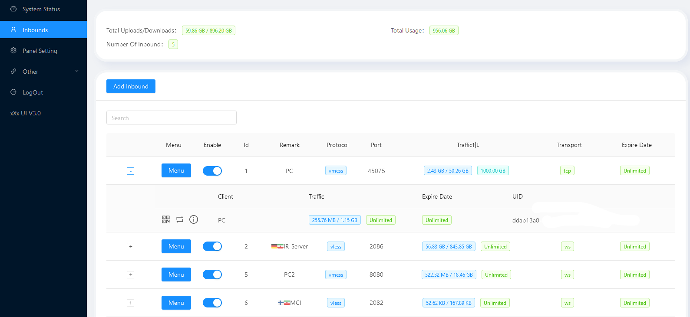
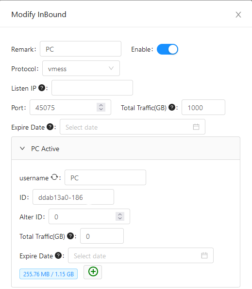
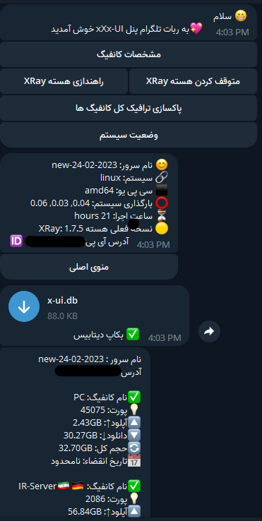

# xXx-ui
یکی دیگر از نسخه های ترجمه شده به انگلیسی و فارسی همراه با تعدادی ویژگی های پیشرفته تر پیاده سازی شده است


# آپدیت

اضافه شدن بکاپ گیری خودکار از دیتابیس

```
x-ui backupBot
```

بعد از وارد کردن دستور بالا توکن ربات را وارد کنید و بعد ایدی عددی کانالی که قرار است بکاپ در آن ارسال شود. ربات باید حتما داخل کانال مدیر باشد. در آخر باید تایمی که ربات در آن زمان باید فایل بکاپ را ارسال کند را وارد کنید و تمام

# امکانات 

-    همه ی قسمت ها به صورت انگلیسی و فارسی و چینی (تنظیمات سمت سرور + رابط کاربری سمت سرور + رابط کاربری وب)
- گرفتن بکاپ از دیتابیس در بخش ربات
 -   دریافت لینک سایت های ایرانی برای رد کردن از ای پی خارج
  -  آپدیت کانفیگ سایت ژئوسایت برای ایران
  -  به روز رسانی برای اضافه کردن کاربر به جای ایمیل
  -  پشتیبانی از پروتکل چند کاربره، web page visualization operation
  -  چندین UUID را می توان به عنوان کاربر ها برای تنظیمات Vmess و Vless و Trojan با QR codes مجزا اضافه کرد
  -  پروتکل های پشتیبانی شده: vmess, vless, trojan, shadowsocks, dokodemo-door, socks, http
  -  پشتیبانی برای تنظیم حالت های بیشتر انتقال
  -  آمار ترافیک، محدود کردن ترافیک، محدودیت با زمان انقضا
  -  قالب های پیکربندی xray قابل تنظیم
  -  پشتیبانی از پنل دسترسی https (نام دامنه + گواهی ssl خود را می توان استفاده کرد)
  -  ربات تلگرام برای توابع اولیه و اعلان ها
  -  پشتیبانی از برنامه گواهینامه SSL با یک کلیک و تمدید خودکار
  -  برای موارد پیکربندی پیشرفته تر، برای جزئیات به پنل مراجعه کنید

# Install & Upgrade

```
bash <(curl -Ls https://raw.githubusercontent.com/MrCenTury/xXx-UI/master/install.sh)
```

# SSL
```
apt-get install certbot -y
certbot certonly --standalone --agree-tos --register-unsafely-without-email -d yourdomain.com
certbot renew --dry-run
```

# IMG






# 2023-02-19
- Update the Jason file for IP hiding changes and receiving the required data
- Geosite site config update for Iran
- Update to add user instead of email
- multi-user vmess - vless - trojan
- Support checking system status information
- support multi protocols and multi users
- support protocols：vmess、vless、trojan、shadowsocks、dokodemo-door、socks、http
- support many transport method including tcp、udp、ws、kcp etc
- traffic counting,traffic restrict and time restrcit
- support custom configuration template
- support https access fot WebUI
- support SSL cert issue by Acme
- support telegram bot notify and control
- more functions in control menu  

## shortcut  
After Installation，you can input `x-ui`to enter control menu，current menu details：
```
---------------------------------------------------------------------------------
        __  __ ____                 __  __           _   _ ___
       |  \/  |  _ \          __  __\ \/ /__  __    | | | |_ _|
       | |\/| | |_) |  _____  \ \/ / \  / \ \/ /____| | | || |
       | |  | |  _ <  |_____|  >  <  /  \  >  <_____| |_| || |
       |_|  |_|_| \_\         /_/\_\/_/\_\/_/\_\     \___/|___|

---------------------------------------------------------------------------------
xXx-UI PANEL MANAGEMENT SCRIPT
---------------------------------------------------------------------------------
Press Enter to exit the script
---------------------------------------------------------------------------------
0. Install xXx-UI
  1. Update xXx-UI
  2. Uninstalled xXx-UI
---------------------------------------------------------------------------------
3. Reset Username Password
  4. Reset Panel Settings
  5. Set the Panel Web Port
  6. Check panel info
---------------------------------------------------------------------------------
7. Start xXx-UI
  8. Stop xXx-UI
  9. Restart xXx-UI
 10. Check xXx-UI Status
 11. View xXx-UI Log
---------------------------------------------------------------------------------
12. Set the xXx-UI auto-start at boot
 13. Cancel the xXx-UI auto-start at boot
---------------------------------------------------------------------------------
14. Update Geosite and Geoip
 15. One-click installation BBR (the latest kernel)
 16. One-click application certificate (ACME script application)
 17. Open all network ports in the server
 18. Install and configure Cloudflare Warp (Experimental)
---------------------------------------------------------------------------------
19. Backup Database
 20. Recovery Database
---------------------------------------------------------------------------------
 21. Backup Auto DataBase Cronjob in Telegram
 22. -> Telegram CronJob Time Change
 23. --> Disable Telegram Backup Auto
---------------------------------------------------------------------------------
```

## Suggested system as follows:
- CentOS 7+
- Ubuntu 18+
- Debian 8+

# telegram
[Group](https://t.me/x_ui_fa)

# credits
- [vaxilu/x-ui](https://github.com/vaxilu/x-ui)
- [XTLS/Xray-core](https://github.com/XTLS/Xray-core)
- [telegram-bot-api](https://github.com/go-telegram-bot-api/telegram-bot-api)  
